# LE Audio Headset (LEHS)

## Table of Contents
- [Overview](#overview)
- [Features](#features)
- [Hardware Requirements](#hardware-requirements)
- [Software Requirements](#software-requirements)
- [Getting Started](#getting-started)
- [Usage Instructions](#usage-instructions)
- [Configuration Parameters](#configuration-parameters)
- [Application Architecture](#application-architecture)
- [Troubleshooting](#troubleshooting)
- [NVRAM Data Storage](#nvram-data-storage)
- [Supported Audio Contexts](#supported-audio-contexts)
- [Performance Characteristics](#performance-characteristics)
- [More Information](#more-information)
- [License](#license)

## Overview
This application demonstrates a Bluetooth LE Audio headset or earbud implementation using the AIROC&#8482; Bluetooth stack.
It acts as an audio sink device that receives audio streams from an LE Audio source (for example, LE Audio Player, smartphone, or broadcast source) using the Generic Audio Framework (GAF).

The application supports both Unicast Sink (point-to-point streaming) and Broadcast Sink (Auracast&#8482; reception) roles as defined by the Bluetooth LE Audio specifications.

## Features

### Supported Roles
- **Unicast Sink**: Receives audio streams from a unicast source (for example, LE Audio Player)
- **Broadcast Sink**: Receives audio broadcasts (Auracast&#8482;), including encrypted streams

### Supported Audio Profiles
| Profile | Description |
| :--- | :--- |
| **BAP** | Basic Audio Profile: core audio streaming (Unicast/Broadcast Sink roles) |
| **CAP** | Common Audio Profile: coordinated audio behaviors across devices |
| **TMAP** | Telephony and Media Audio Profile (Call Terminal, Unicast/Broadcast Media Receiver) |
| **GMAP** | Gaming Audio Profile: low-latency gaming audio (UGT/BGR roles) |
| **HAP** | Hearing Access Profile: hearing aid preset management |

### Supported GATT Services
| Service | Acronym | Purpose |
| :--- | :--- | :--- |
| **Audio Stream Control Service** | ASCS | Stream setup and control (Sink and Source ASEs) |
| **Published Audio Capabilities Service** | PACS | Advertisement of audio codec capabilities |
| **Volume Control Service** | VCS | Volume control for the audio device |
| **Volume Offset Control Service** | VOCS | Volume offset control for individual audio outputs |
| **Microphone Control Service** | MICS | Microphone mute control |
| **Audio Input Control Service** | AICS | Individual microphone input control |
| **Coordinated Set Identification Service** | CSIS | Stereo earbud pairing and coordinated set management |
| **Broadcast Audio Scan Service** | BASS | Broadcast source discovery and sync management |
| **Hearing Aid Service** | HAS | Hearing aid preset management |
| **Telephony Media Audio Service** | TMAS | TMAP role advertisement |
| **Gaming Media Audio Service** | GMAP | GMAP role advertisement |
| **Generic Media Control Service** | GMCS | Media playback control (client) |
| **Generic Telephone Bearer Service** | GTBS | Telephone call control (client) |

### Key Application Capabilities
- Up to **2** simultaneous LE ACL connections (`LEHS_MAX_CONNECTIONS`)
- Up to **1** BIG (Broadcast Isochronous Group) synchronization (`LEHS_MAX_BIG`)
- Volume control with **15-step** granularity (`VCS_STEP_SIZE`)
- Configurable device role: **Left Earbud**, **Right Earbud**, or **Headphone**
- **Swift Pair** advertising support (Microsoft Fast Pair)
- Encrypted broadcast stream support with broadcast code entry
- Coordinated set support for stereo earbud pairs (CSIS)
- Hearing aid preset control with up to 20-character preset names
- Support for multiple audio contexts (Media, Conversational, Gaming, and more)

### Audio Stream Endpoints (ASEs)
- **2 Sink ASEs**: Receive audio from source devices
- **1 Source ASE**: Transmit microphone audio to source devices

## Hardware Requirements
- **Target Board**: `APP_CYW955513EVK-01` (CYW55513 Evaluation Kit)
- USB cable for programming and UART tracing
- Optional LE Audio Player, smartphone, or broadcast source for testing

## Software Requirements
- **ModusToolbox&#8482;** software v3.6 or later
- **GCC_ARM** toolchain (bundled with ModusToolbox&#8482;)
- **ClientControl** application (HCI-based control and testing)
- **BTSpy** application (protocol and application trace analysis)

## Getting Started

### Build Instructions

#### 1. Clone or Import the Project
When cloning or importing in ModusToolbox, work from your MTW workspace.

Navigate to the application directory:

```sh
cd <mtw_workspace>/<application name>
```

Example:

```sh
cd <mtw_workspace>/lehs
```

#### 2. Select the Correct Build Shell on Windows

On Windows, run build and program commands from the
**ModusToolbox Shell**. Standard PowerShell or CMD sessions usually do not
have `make` in `PATH`, so commands such as `make build` and `make program`
will fail with `make is not recognized`.

If you use VS Code on Windows, open VS Code from the ModusToolbox Shell or
configure the integrated terminal to inherit that environment before running
the commands below.

#### 3. Configure Build Options
The following build-time options are configured in the `makefile`:

| Option | Default | Purpose |
| :--- | :--- | :--- |
| `TARGET` | `APP_CYW955513EVK-01` | Target board/BSP |
| `TOOLCHAIN` | `GCC_ARM` | Toolchain selection |
| `CONFIG` | `Debug` | Build type (`Debug` or `Release`) |
| `LIFE_CYCLE_STATE` | `DM` | Device lifecycle state |
| `SUPPORT_LE_AUDIO_STEREO` | Enabled | Enable stereo audio support |
| `CTLR_DELAY` | `35000` | Controller presentation delay (microseconds) |
| `SIMULATED_NVRAM` | `1` | Use client-side (host) NVRAM emulation |
| `MULTIPLEX_AUDIO_SUPPORTED` | Disabled | Enable multiplexed audio (L+R on same channel) |
| `MAX_SUPPORTED_OCTETS_PER_CODEC_FRAME` | `0x64` | Max octets per codec frame (increase to `0xA0` for configs greater than `48_2_2`) |

#### 4. Multi-Board Configuration

When programming more than one board at the same time, do not leave `UART=AUTO` in the `makefile`. Set the UART explicitly so each Eclipse or command-line program action targets the intended board.

Example for a headset board on `COMx`:

```make
UART=COMx
```

If you are using this headset together with the LE Audio Player app,
a common setup is:
- LEHS: `apps/lehs/makefile` -> `UART=COMx`
- LEPL: `apps/lepl/makefile` -> `UART=COMy`

Also configure `BT_DEVICE_ADDRESS` in each app makefile so both boards use
different addresses:
- Keep one board as `BT_DEVICE_ADDRESS=default`
- Set the other board to a different value

Adjust the COM port numbers to match Device Manager on your system.

#### 5. Select Device Type
Set `LEHS_APP_DEVICE_TYPE` in `lehs.h` or via `CY_APP_DEFINES`
in the makefile:
- `APP_DEVICE_TYPE_EAR_BUD_LEFT` (1): Left earbud of a stereo pair
- `APP_DEVICE_TYPE_EAR_BUD_RIGHT` (2): Right earbud of a stereo pair
- `APP_DEVICE_TYPE_HEADPHONE` (3): Stereo headphone (default)

By default, `LEHS_APP_DEVICE_TYPE` is set to
`APP_DEVICE_TYPE_HEADPHONE` in `lehs.h`.
For customer projects, set the device type from the makefile
instead of editing source.

Example (`apps/lehs/makefile`):

```make
CY_APP_DEFINES += LEHS_APP_DEVICE_TYPE=APP_DEVICE_TYPE_EAR_BUD_LEFT
# CY_APP_DEFINES += LEHS_APP_DEVICE_TYPE=APP_DEVICE_TYPE_EAR_BUD_RIGHT
# CY_APP_DEFINES += LEHS_APP_DEVICE_TYPE=APP_DEVICE_TYPE_HEADPHONE
```

#### 6. Configure CSIS SIRK (Stereo Earbuds)
For coordinated set (stereo earbud) operation, configure the
Set Identity Resolving Key (SIRK):
- `LEHS_APP_SIRK_TYPE`
  - `GA_LIB_CSIS_SIRK_PLAIN` (default): Plain-text SIRK
  - `GA_LIB_CSIS_SIRK_ENCR`: Encrypted SIRK
- `LEHS_APP_SIRK_VALUE`: 16-byte SIRK value (must be identical for both earbuds in a pair)

#### 7. Build the Application

Using make:

```sh
make build
```

Using ModusToolbox IDE:
- Right-click project
- Select **Build Application**

### Program the Device

#### Using ModusToolbox IDE
1. Connect the evaluation kit to your PC via USB.
2. Right-click the project.
3. Select **Program** or **Debug**.

#### Using Command Line

```sh
make program
```

## Usage Instructions

### Unicast Sink Mode

#### Setup
1. **Build and Program**: Flash LEHS to the AIROC&#8482; board.
2. **Open ClientControl**:
   - Launch ClientControl on your PC.
   - Use the ClientControl executable bundled with the same
     ModusToolbox&#8482;/SDK release as this application.
     A typical location is
     `btsdk-host-apps-bt-ble/release-vX.X.X/client_control/Windows`.
   - Avoid using an older ClientControl from another tools release because
     the LE Audio UI can open with greyed-out or non-clickable controls when
     the versions do not match.
   - Create a writable folder for ClientControl settings, for example
     `<mtw_workspace>/clientcontrol/lehs`.
   - Launch ClientControl from that folder so `clientcontrol.ini`
     is created and reused there.
   - Open the **WICED HCI** port for the device.
   - Use the default baud rate from BSP `HCI_UART_DEFAULT_BAUD` (typically `3000000` or `115200`).
   - Select the COM port corresponding to the device (for example `COMx`) and click **Open Port**.

   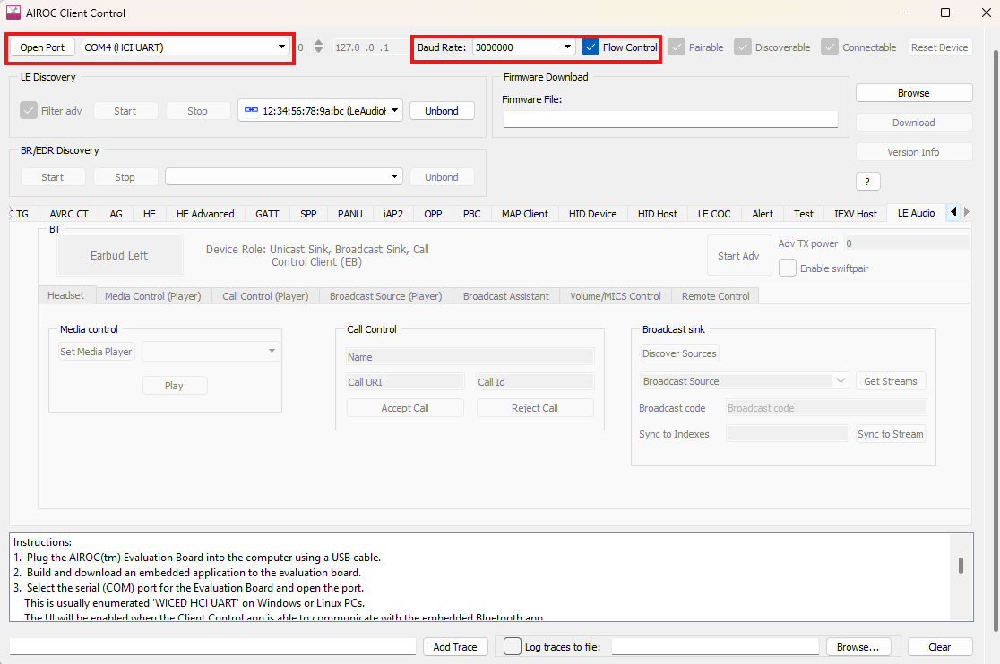

3. **Start Advertising**:
   - Press **Start Adv** to start advertising.
   - Confirm the log shows advertising started successfully, for example `adv state 3`.
   - Press **Stop Adv** to stop advertising.

   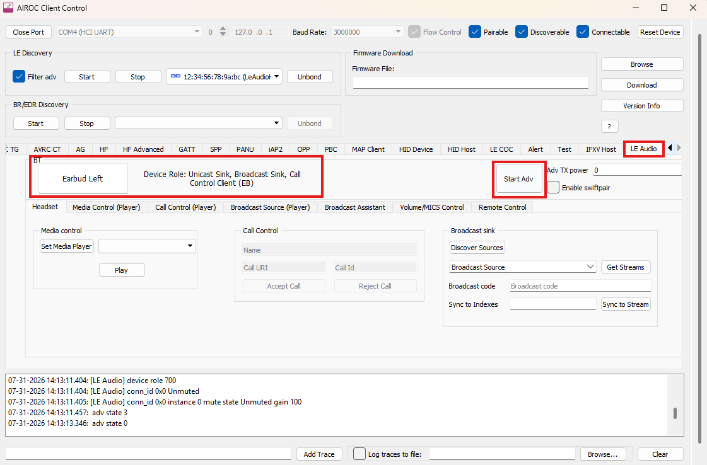

4. **Connect Source Device**:
   - Discover **LeAudioHS** from your source device (for example, LE Audio Player app or smartphone).
   - Connect to the headset.
5. **Start Streaming**: Begin audio playback from the source device.
   - To hear audio, connect wired earphones or headphones to the headset board
     audio output jack or header used by your EVK setup.
    - For mic/callback path validation, connect to `C29`
       (right mic path), not the other mic connector.
   - The application configures the board audio path, but audible playback
     still depends on the EVK audio hardware being connected correctly.
   - Verify streaming success in logs by looking for entries such as `ASE state: Streaming` and `CIS established`.
    - If needed, use BTSpy with silent logging enabled to capture traces
       while reproducing stream or callback issues.
6. **Control Audio**: Use ClientControl to adjust volume, mute/unmute, and media playback.
7. **Disconnect**:
   - Press **Disconnect** to terminate the connection.
   - Press **Unbond** to remove bonding information and disconnect.

   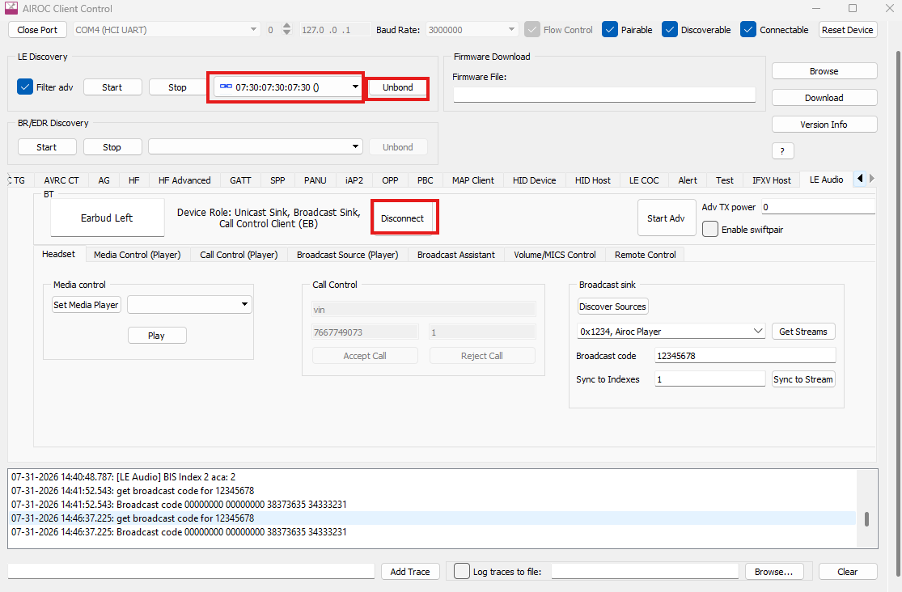

#### First Successful Stream
Use this sequence for the fastest end-to-end bring-up with LE Audio Player:

1. Headset board on `COMx`: open the port at `3000000` baud in ClientControl.
2. Open the **LE Audio** tab and press **Start Adv**.
3. Confirm the log reports advertising started, for example `adv state 3`.
4. On the player board, open `COMy` at `3000000` baud.
5. In the player LE Audio UI, enable the advertising filter, start scanning, select **LeAudioHS**, and connect.
6. Start media playback from the player using the selected audio config and
   any suitable test audio file from
   `bluetooth_apps/libraries/COMPONENT_audio_module/test_audio_files`
   (WAV sample rate must match the selected config).
7. Confirm the headset-side logs show the stream reaches `ASE state: Streaming` and `CIS established`.

#### Features in Unicast Mode
- Bidirectional audio streaming (sink and source)
- Volume control from source device
- Microphone mute control
- Media playback control
- Telephony call control
- Multiple audio-context support

#### Media Control
- Use ClientControl to send media commands (Play, Pause).
- Press **Play** to start media playback.
- Press **Pause** to stop media playback.

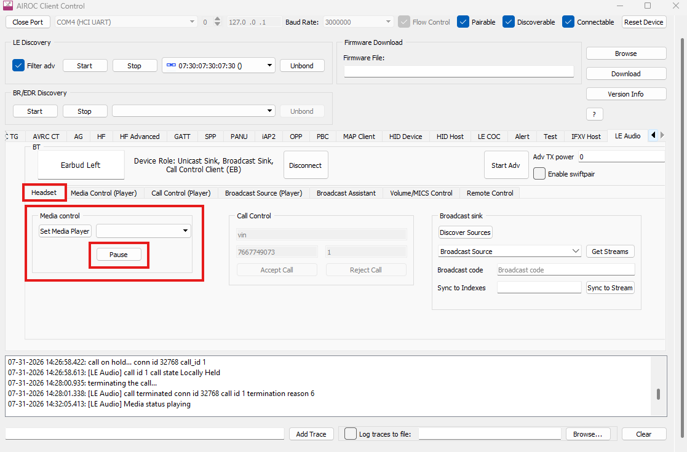

#### Telephony Control
1. **Accept Call**:
   - On incoming call, the application notifies ClientControl via HCI event.
   - Press **Accept Call** to answer.

   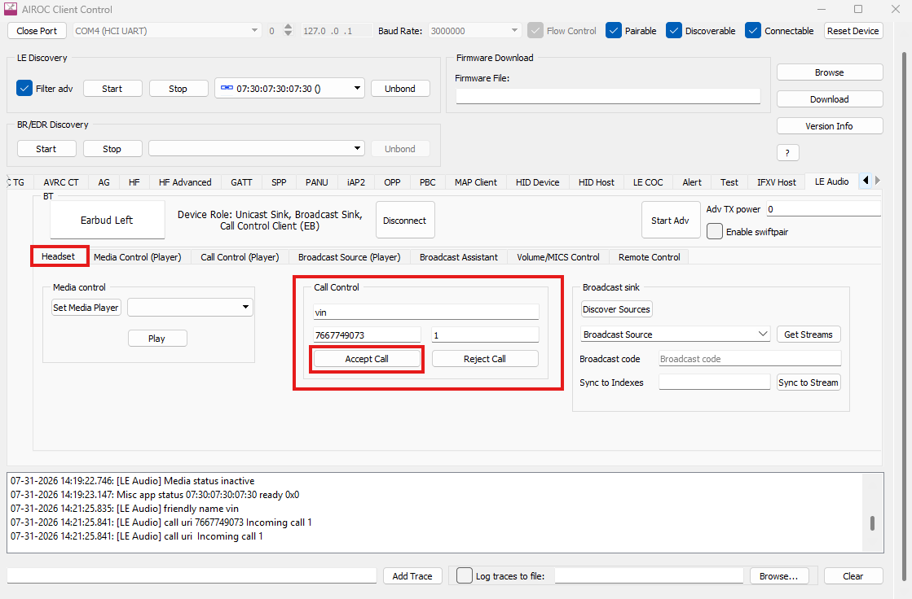

2. **Reject Call**:
   - On incoming call, the application notifies ClientControl via HCI event.
   - Press **Reject Call** to decline.

   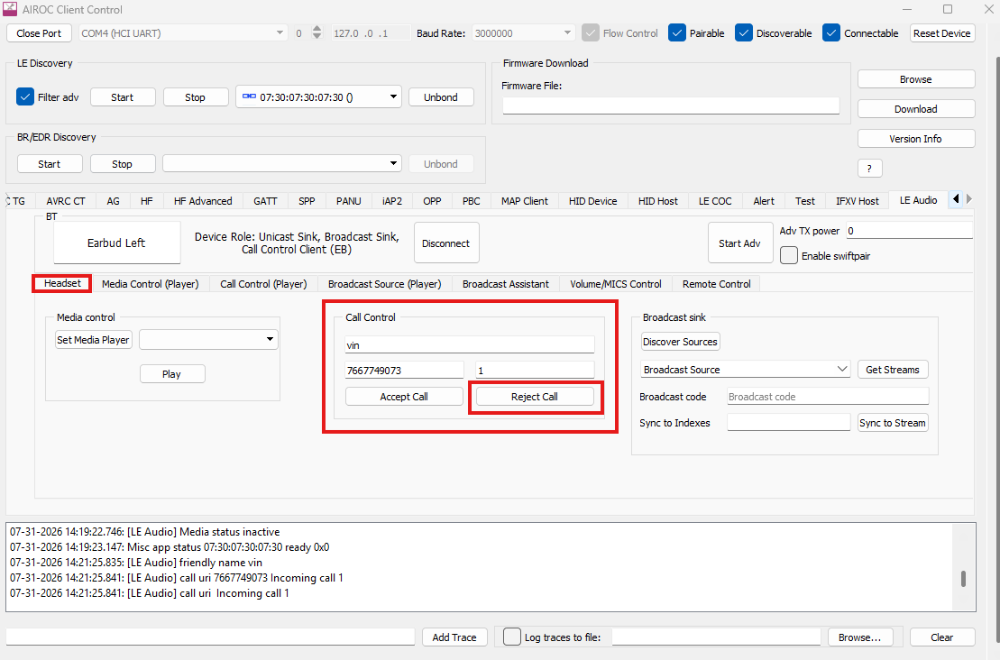

3. **Put Call on Hold**:
   - Press **Put on Hold** to hold an ongoing call.

   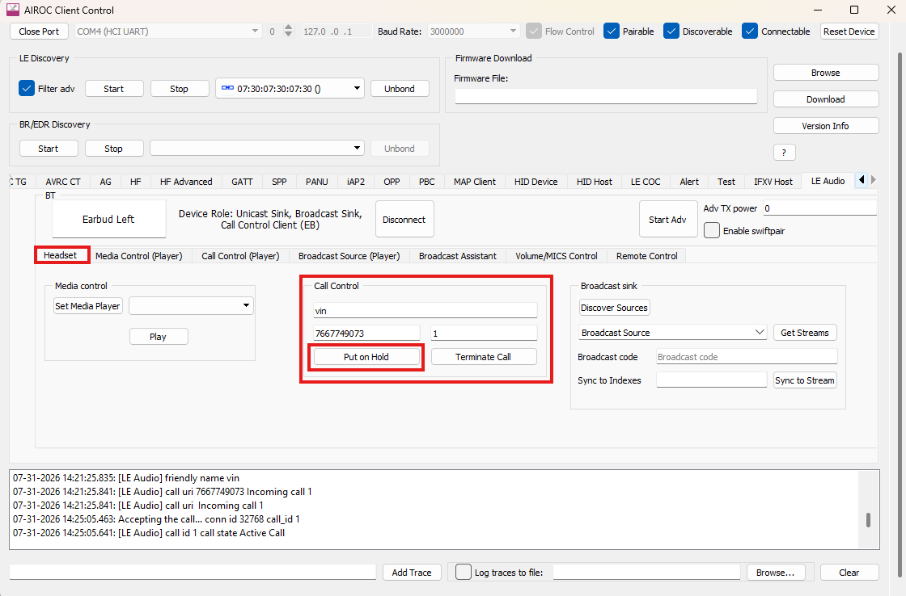

4. **Resume Call**:
   - Press **Retrieve Call** to resume a held call.

   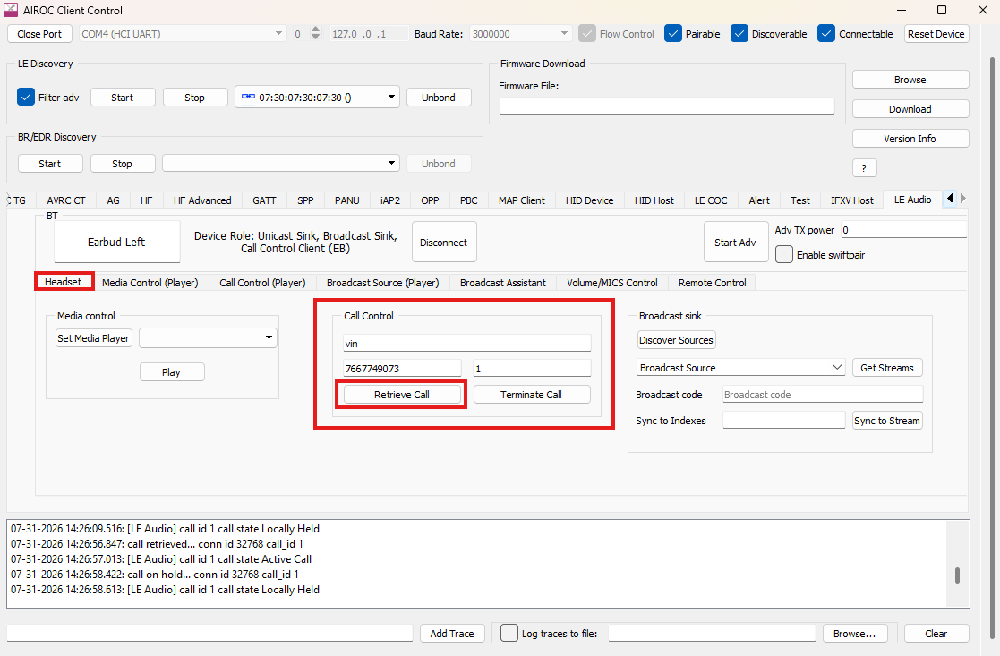

5. **Hang Up Call**:
   - Press **Terminate Call** to end an ongoing call.

   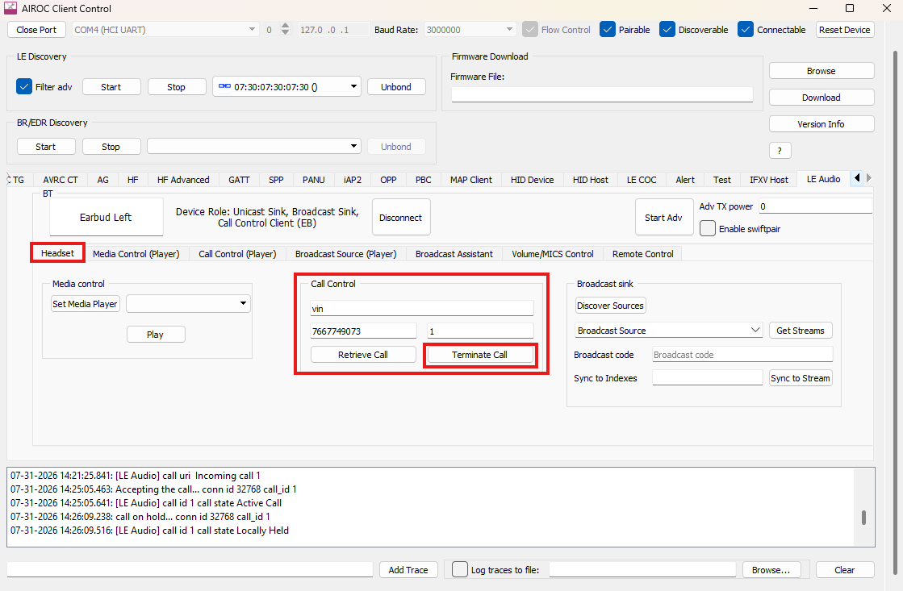

### Broadcast Sink Mode (Auracast&#8482;)

#### Setup
1. **Build and Program**: Flash LEHS to the AIROC&#8482; board.
2. **Open ClientControl**: Connect through the **WICED HCI** port.
3. **Discover Broadcast Sources**:
   - Press **Discover Sources** to start scanning.
   - Available sources are displayed with Broadcast ID and name.
   - Press **Stop Discovery** to stop scanning.

   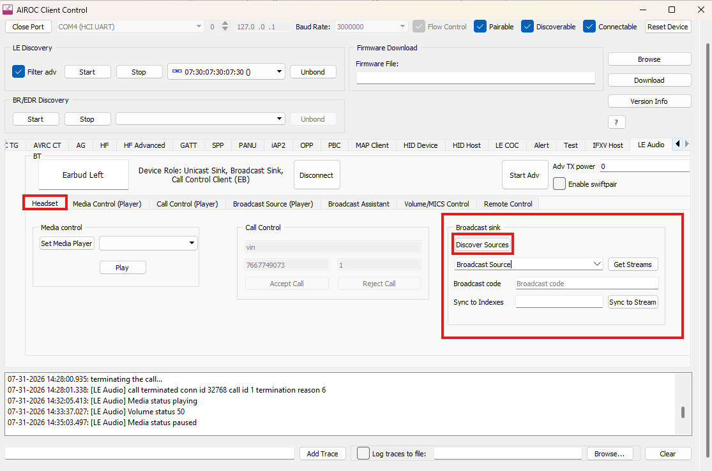

4. **Synchronize to Periodic Advertisement**:
   - Select a discovered broadcast source.
   - Press **Get Streams** to retrieve available streams.
   - Stream info is displayed with BIS ID.

   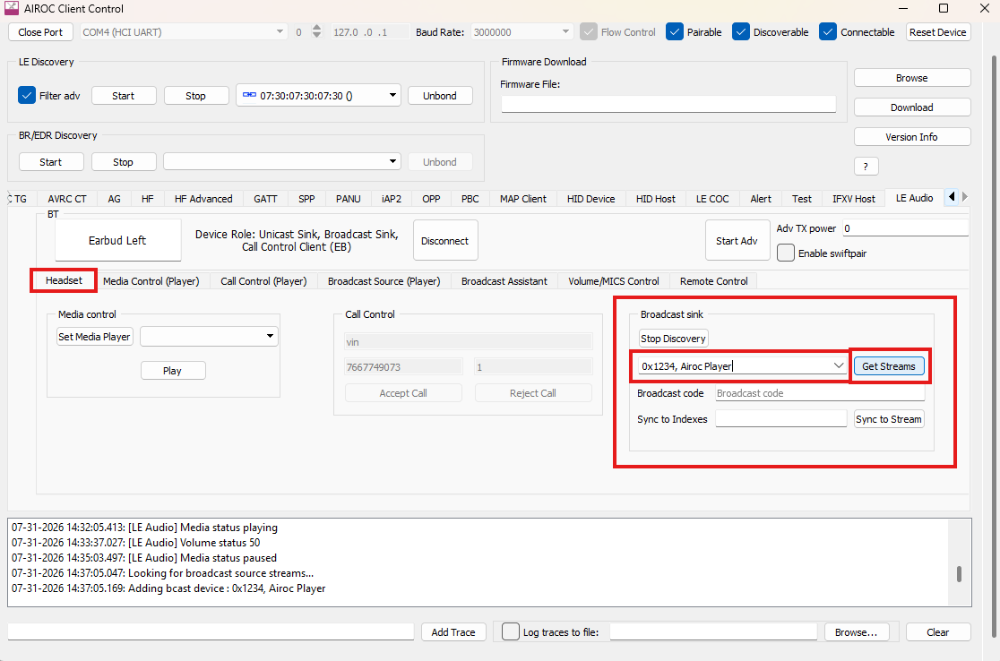

5. **Synchronize to Broadcast Stream**:
   - Enter the broadcast code (only for encrypted streams).
   - Enter BIS bitfield in hex in **Sync to Indexes**.
   - BIS index mapping examples:
     - BIS 1: enter `1` (`0001`)
     - BIS 2: enter `2` (`0010`)
     - BIS 3: enter `4` (`0100`)
     - BIS 1 and 2: enter `3` (`0011`)
   - Press **Sync to Stream**.

   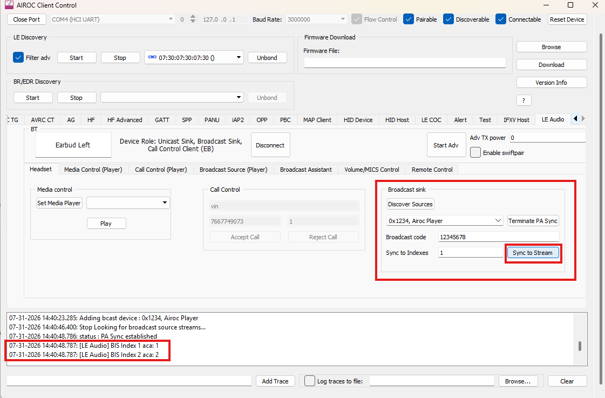

6. **Receive Audio**: Once synchronized, the device receives and plays broadcast audio.
7. **Terminate Stream**:
   - Press **Terminate Stream** to stop the broadcast stream.

   

#### Broadcast Encryption Support
- Encrypted broadcast stream support
- Broadcast code entry via ClientControl
- Automatic synchronization after valid code entry

#### Volume Control
1. **Set Volume**:
   - Enter the desired value in **Volume Setting** and press **Set Volume**.
   - Press **+** to increase volume by one step.
   - Press **-** to decrease volume by one step.
2. **Mute/Unmute**:
   - Press **Mute** to mute overall sink volume.
   - Press **Unmute** to unmute overall sink volume.


### Using BTSpy for Debugging
1. Launch **BTSpy**.
    - Use the BTSpy executable bundled with the same ModusToolbox&#8482;/SDK
       release as this application. A typical location is
       `btsdk-utils/release-vX.X.X/BTSpy/Windows`.
    - Example in this repository:
       `apps/mtb_shared/wiced_btsdk/tools/btsdk-utils/release-v4.9.6/BTSpy/Windows/BTSpy.exe`.
2. Connect to the device HCI UART port.
3. View real-time protocol and application traces.
4. Analyze Bluetooth LE events, GATT operations, and audio stream activity.

## Configuration Parameters

### Audio Configuration
The application supports these LC3 audio configurations:

| Config | Sampling Rate | Frame Duration | Octets/Frame |
| :--- | :--- | :--- | :--- |
| 8_1_1 | 8 kHz | 7.5 ms | 26 |
| 8_2_1 | 8 kHz | 10 ms | 30 |
| 16_1_1 | 16 kHz | 7.5 ms | 30 |
| 16_2_1 | 16 kHz | 10 ms | 40 |
| 24_1_1 | 24 kHz | 7.5 ms | 45 |
| 24_2_1 | 24 kHz | 10 ms | 60 |
| 32_1_1 | 32 kHz | 7.5 ms | 60 |
| 32_2_1 | 32 kHz | 10 ms | 80 |
| 48_1_1 | 48 kHz | 7.5 ms | 75 |
| 48_2_1 | 48 kHz | 10 ms | 100 |
| 48_3_1 | 48 kHz | 7.5 ms | 90 |
| 48_4_1 | 48 kHz | 10 ms | 120 |
| 48_5_1 | 48 kHz | 7.5 ms | 117 |
| 48_6_1 | 48 kHz | 10 ms | 155 |

> **Note:** For configurations higher than 48_2_2, set `MAX_SUPPORTED_OCTETS_PER_CODEC_FRAME=0xA0` in the makefile.

### Volume Control
- **Default Volume**: 50 (range 0 to 255)
- **Step Size**: 15
- Volume changes can be initiated from:
  - Source device (via VCS)
  - Local controls (if implemented)

### Memory Configuration
- **Heap Size**: 0xF000 (60 KB)
- **BT Stack Heap**: 12 KB

## Application Architecture

### Main Components
- **lehs_main.c**: Application entry point and stack initialization
- **lehs_btmgr.c**: Bluetooth management event handling
- **lehs_gatt.c**: GATT database and connection management
- **lehs_ascs.c**: Audio Stream Control Service implementation
- **lehs_bass.c**: Broadcast Audio Scan Service implementation
- **lehs_cis.c**: Connected Isochronous Stream handling
- **lehs_bis.c**: Broadcast Isochronous Stream handling
- **lehs_isoc.c**: Generic isochronous event handling
- **lehs_pacs.c**: Published Audio Capabilities Service
- **lehs_vcs.c**: Volume Control Service implementation
- **lehs_mics.c**: Microphone Control Service implementation
- **lehs_csis.c**: Coordinated Set Identification Service
- **lehs_has.c**: Hearing Aid Service implementation
- **lehs_gmap.c**: Gaming Audio Profile implementation
- **lehs_nvram.c**: Non-volatile memory management
- **lehs_rpc.c**: RPC communication with ClientControl

### GATT Database Structure
The GATT database includes handles for:
- Generic Attribute Service (0x0001 to 0x000A)
- Generic Access Service (0x0020 to 0x0026)
- Volume Control Service (0x0030 to 0x003A)
- Volume Offset Control Service (0x0040 to 0x004B)
- Published Audio Capabilities Service (0x00D0 to 0x00E2)
- Audio Stream Control Service (0x0100 to 0x010C)
- Common Audio Service (0x0140)
- Broadcast Audio Scan Service (0x0180 to 0x0185)
- Coordinated Set Identification Service (0x0190 to 0x019B)
- Microphone Control Service (0x01A4 to 0x01BF)
- Hearing Aid Service (0x01E0 to 0x01E9)
- Telephony Media Audio Service (0x0200 to 0x0202)
- Gaming Audio Service (0x0210 to 0x0216)

## Troubleshooting

### Device Not Advertising
- Verify the device is powered on and programmed correctly.
- Check ClientControl connection to the HCI UART port.
- Ensure advertising has been started from ClientControl.

### Cannot Connect to Source Device
- Verify Bluetooth is enabled on the source device.
- Check that device name **LeAudioHS** is visible while scanning.
- Ensure there is no severe interference from nearby Bluetooth devices.
- If operating in a noisy RF environment, connect an external/shared antenna
   to `J3` and use that path for better link stability.
- Check RSSI in the scan/connect logs. If RSSI is weak, reduce distance,
   improve antenna orientation, or remove nearby RF interference sources.

### No Audio Playback
- Verify the audio stream is established (check BTSpy logs).
- Check volume (it may be muted or set to 0).
- Ensure both devices support the selected audio configuration.
- Verify CIS/BIS links are established.

### Player Shows `StartMic: Device not ready to play`
- Disconnect and unbond on both boards.
- Perform recovery on each board using the switch sequence:
  1. Press and hold **Recover** (`SW1`).
  2. While holding `SW1`, press and release **Reset** (`SW2`).
  3. Keep holding `SW1` for about 2 seconds after releasing `SW2`, then release `SW1`.
- Re-open the correct COM ports if needed.
- Restart the advertising, scanning, connect, and play sequence.

### Broadcast Source Not Found
- Ensure the broadcast source is actively transmitting.
- Check scan duration and scan parameters.
- Verify the source is in range.

### Encrypted Broadcast Fails
- Verify the entered broadcast code is correct.
- Ensure broadcast code matches source configuration.
- Check BTSpy logs for encryption-related failures.

### Debug Traces
Enable additional debug output by defining:

```c
#define WICED_BT_TRACE_ENABLE
```

View traces using BTSpy or a serial terminal at the configured baud rate.

## NVRAM Data Storage
With simulated NVRAM (host-side), the application stores:
- Bonding information
- GATT database hash
- Client Characteristic Configuration Descriptors (CCCD)
- Device pairing keys
- Service discovery cache

Set `SIMULATED_NVRAM=1` in the makefile to enable client-side NVRAM emulation.

## Supported Audio Contexts
- **Unspecified**: General audio
- **Conversational**: Voice call
- **Media**: Music and video audio
- **Game**: Low-latency gaming audio
- **Instructional**: Prompts and guidance
- **Voice Assistants**: Siri, Google Assistant, and others
- **Live Audio**: Live events and concerts
- **Sound Effects**: UI sounds and alerts
- **Notifications**: System notifications
- **Ringtone**: Incoming call alerts
- **Alerts**: Alarms and timers
- **Emergency Alerts**: Critical system alerts

## Performance Characteristics
- **Audio Latency**: Configurable via `CTLR_DELAY` (default 35 ms)
- **Maximum Connections**: 2 simultaneous ACL connections
- **Maximum BIGs**: 1 broadcast isochronous group
- **Connection Interval**: 7.5 to 4000 ms (configurable)
- **Advertising Interval**:
  - High duty: 30 to 60 ms
  - Low duty: 1024 ms

## More Information
- [Infineon Technologies](https://www.infineon.com)
- [ModusToolbox&#8482; Software](https://www.infineon.com/modustoolbox)
- [AIROC&#8482; Bluetooth&#8482; SDK](https://github.com/Infineon/btsdk-docs)
- [LE Audio Specifications](https://www.bluetooth.com/specifications/specs/le-audio/)
- [Auracast&#8482; Information](https://www.bluetooth.com/auracast/)

## License
This application is provided under the Apache License 2.0. See LICENSE file for details.

---

Copyright (c) 2024 Infineon Technologies. All rights reserved.
